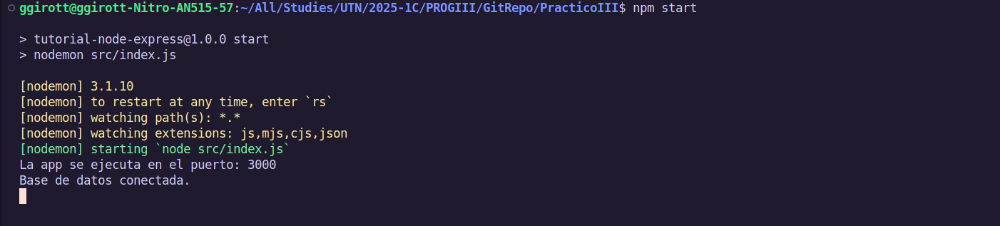
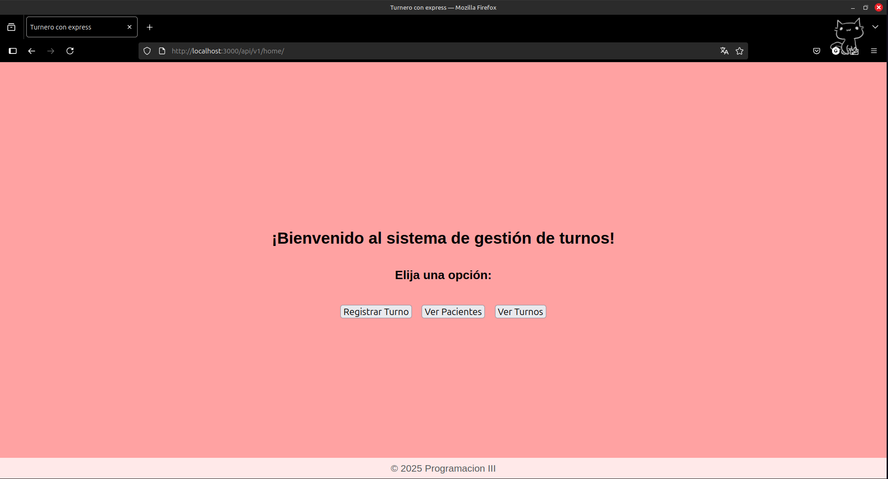
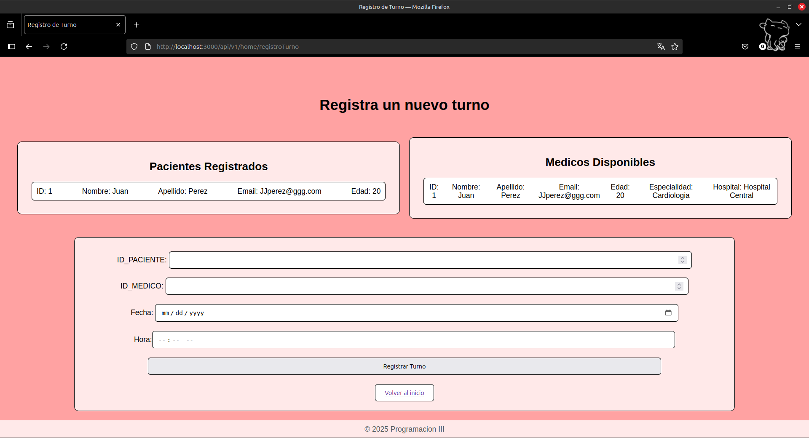
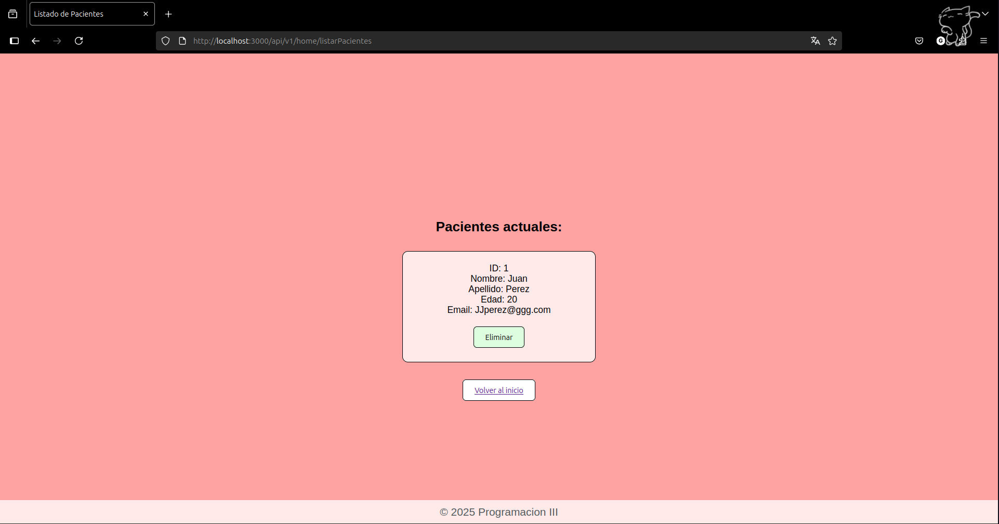
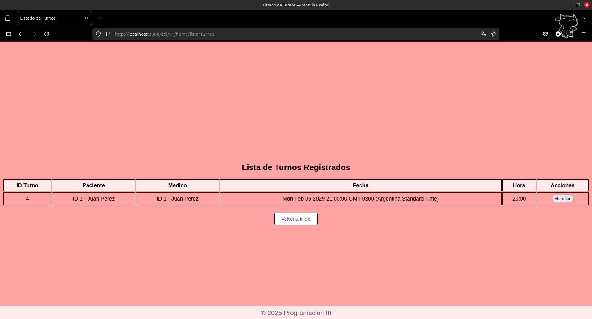
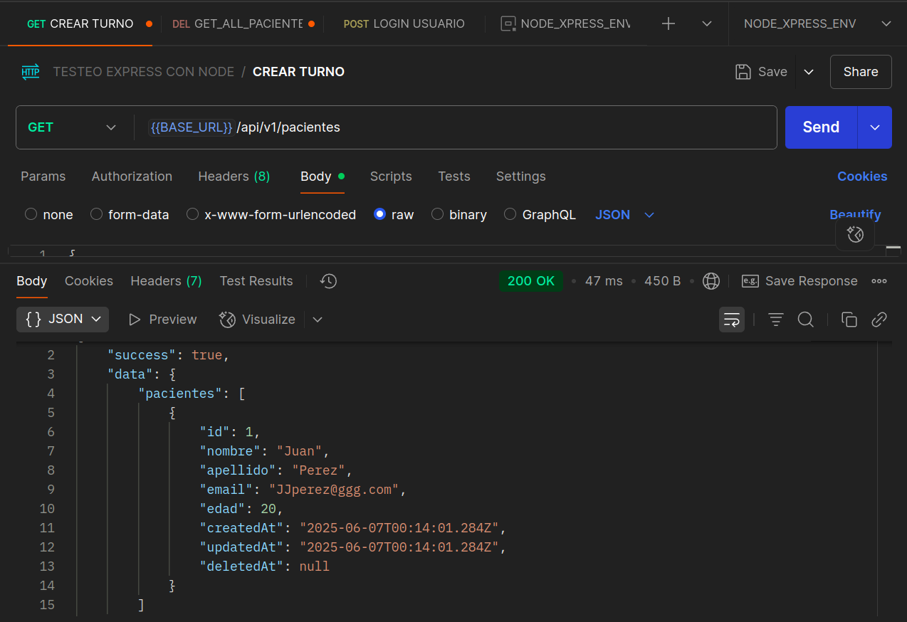
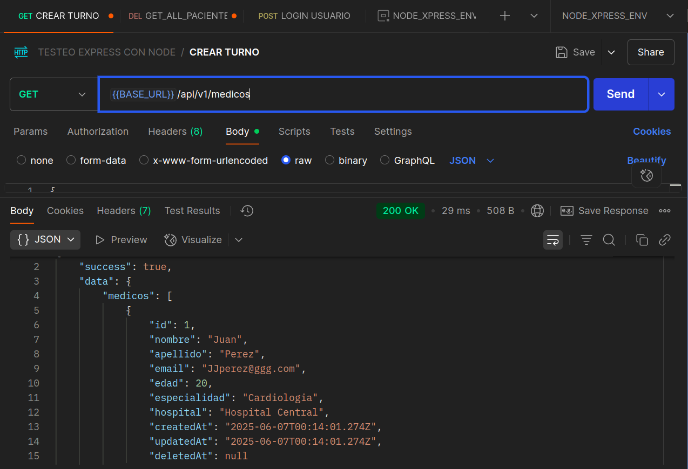

# API de Gestión Médica

Este proyecto es una API desarrollada con Node.js, Express y Sequelize. Permite la gestión de pacientes y turnos. Incluye vistas utilizando Pug.

## Instalación

1. Clonar el repositorio. 
   En una distro GNU/Linux (o utilizando WSL), abrir una terminal y ejecutar:
   
        git clone github.com/GonzaloGirotti/TUP-ProgIII 
        cd TUP-ProgIII/PracticoIII 
        code . 

2. En la terminal de VSCODE, para instalar dependencias:

        npm install

3. Configurar variables de entorno ->
   Crear un archivo .env en la raíz del proyecto con el siguiente contenido:

        PORT=3000
        TEMPLATE=pug
        JWT_SECRET=(una clave secreta para JWT)

4. En la terminal de VSCODE, inicializar el servidor y la base de datos:

        npm start

5. Ahora para detener el servidor y poder crear los datos de ejemplo, presiona `Ctrl + C` en la     terminal.

6. En la terminal de VSCODE, para crear paciente y medico de ejemplo, ejecutar:

        npm run db:seed

7. En la terminal de VSCODE, inicializar el servidor nuevamente:

        npm start

## Endpoints del proyecto:

### Utilizando Postman, puedes probar los siguientes endpoints:

#### Autenticación (/auth)

    Solicitud POST -> localhost:3000/auth/registro
    Registra un nuevo usuario (requiere campos: 'nombre_usuario', 'email', 'password').

    Solicitud POST -> localhost:3000/auth/login
    Inicia sesión con credenciales de usuario (requiere campos: 'email' y 'password').
    Devuelve un token JWT si las credenciales son correctas.

#### Pacientes (/api/v1/pacientes)

    Solicitud GET -> /api/v1/pacientes
    Lista todos los pacientes.

    Solicitud GET -> /api/v1/pacientes/:idPaciente
    Muestra los detalles de un paciente específico.

    Solicitud POST -> /api/v1/pacientes
    Crea un nuevo paciente.

#### Médicos (/api/v1/medicos)

    Solicitud GET -> /api/v1/medicos
    Lista todos los médicos.

    Solicitud GET -> /api/v1/medicos/:idMedico
    Muestra los detalles de un médico.

    Solicitud POST -> /api/v1/medicos
    Crea un nuevo médico.

#### Turnos (/api/v1/turnos)

    GET -> /api/v1/turnos
    Lista todos los turnos.

    GET -> /api/v1/turnos/:idPaciente
    Muestra los turnos de un paciente específico. Tambien detalla el medico.

    POST -> /api/v1/turnos/crearTurnoAPI
    Crea un nuevo turno. (requiere token de autenticación JWT)

    POST -> /api/v1/turnos/crearTurnoLocal
    Ruta que al crear un turno con exito o con error desde la vista PUG, renderiza vista de error o de exito segun el caso.

    DELETE -> /api/v1/turnos/:id
    Elimina un turno.

#### Rutas con vistas PUG (/api/v1/home)

    GET -> /api/v1/home
    Muestra la vista principal para acceder a crear turno, ver turnos, ver pacientes.

    GET -> /api/v1/turnos/registroTurno
    Muestra el formulario para crear un nuevo turno.

    GET -> /api/v1/turnos/listarTurnos
    Muestra la lista de turnos registrados.

    GET -> /api/v1/turnos/listarPacientes
    Muestra la lista de pacientes dados de alta.

    DELETE -> /api/v1/turnos/eliminarTurno/:idTurno
    Elimina un turno específico y redirige a la lista de turnos.

    DELETE -> /api/v1/pacientes/eliminarPaciente/:idPaciente
    Elimina un paciente específico y redirige a la lista de pacientes.

## Tecnologías utilizadas

    Node.js

    Express

    Sequelize ORM

    SQLite (modo desarrollo)

    JWT para autenticación

    Joi para validación

    Pug como motor de plantillas

## Screenshots:

## Integrantes del grupo:
    Gonzalo Girotti
    Mariano Garcia Rigano
    Jeremias Diaz
    Marcos Diaz
    Pedro Crowley